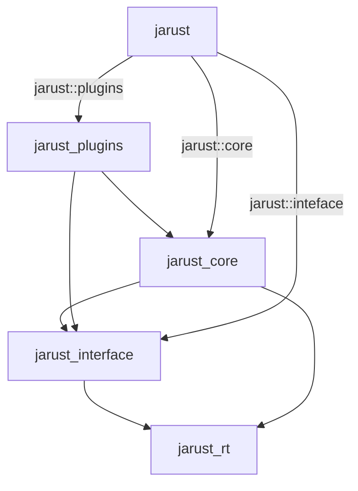

Jarust is just an umbrella crate for `jarust_core`, `jarust_plugins` and `jarust_interface`.

## Core

The core provides high-level api to connect, create session, attach, detach, ...

It relies on abstractions from the interface crate, meaning we can provide our own implementation of `JanusInterface` and
pass it to the core, for example, to use the RabbitMQ interface.

## Interface

It contains the core data structures; errors, responses, and messages as well as the transport that communicates with
the janus server. The transport is abstract, so to create a new transport we can implement the `JanusInterface` trait
then provide it to the connect functions.

The transaction generation is also abstract with 2 built-in ones, UUID v4 and random string.

## Plugins

Plugins wraps the generic handle from the core crate and adds the plugin specific functionalities and event parsing,
while also has a handle `Deref` to add unsupported functionalities.

## Runtime

We're trying to be runtime agnostic so we created `jarust_rt` that abstracts the runtime, but currenctly only tokio is supported.

Any task spawing should be from `jarust_rt::spawn` function.
